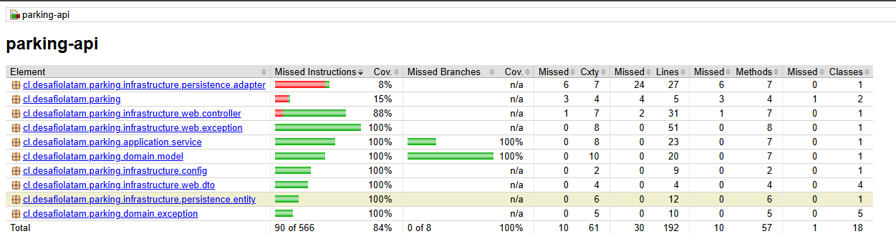

# Parking Full-Stack - Backend API

Microservicio REST para administrar estadías de vehículos. Permite registrar entradas, consultar estadías y registrar salidas, aplicando reglas de negocio antes de persistir los cambios en PostgreSQL.

Este repositorio corresponde al backend del proyecto integrador. El frontend relacionado se encuentra en [desafio-latam-typescript-vite](https://github.com/Janeitor/desafio-latam-typescript-vite).

## Alcance académico

Este microservicio fue desarrollado con fines académicos para demostrar los requisitos acumulativos de la rúbrica: diseño guiado por el dominio, separación por capas, desarrollo guiado por pruebas, contratos REST semánticos, persistencia con JPA y PostgreSQL, configuración mediante perfiles y medidas básicas de seguridad.

El dominio implementado corresponde al control operativo de entradas y salidas de vehículos en un único estacionamiento. El objetivo evaluable es demostrar con precisión el ciclo completo `frontend -> API -> reglas de negocio -> PostgreSQL -> frontend`, no construir una plataforma comercial completa.

El alcance se limita deliberadamente a:

- crear una estadía cuando un vehículo ingresa;
- consultar estadías persistidas;
- localizar estadías por UUID o patente;
- cerrar una estadía registrando su salida;
- proteger las reglas centrales mediante pruebas automatizadas.

No se modelan múltiples estacionamientos, reservas anticipadas, disponibilidad por horarios, asignación de espacios, tarifas, pagos, cuentas de usuario ni autenticación. Esas capacidades corresponderían a otros agregados y casos de uso, como `ParkingLot` y `Reservation`. Agregarlas sin sus reglas, persistencia y pruebas produciría una solución superficial y excedería el propósito de esta entrega.

Aunque el proyecto demuestra prácticas solicitadas para entornos productivos —como exclusión de secretos, perfiles, CORS y Swagger restringido— no se presenta como un sistema comercial completo ni como una solución lista para desplegar sin una evaluación adicional de seguridad, operación y escalabilidad.

## Funcionalidades

- Registrar la entrada de un vehículo.
- Normalizar patentes a mayúsculas.
- Impedir dos estadías activas simultáneas para la misma patente.
- Consultar todas las estadías.
- Consultar una estadía por UUID.
- Buscar una estadía activa por patente.
- Registrar la salida y actualizar la estadía en PostgreSQL.
- Rechazar horas de salida nulas o anteriores a la entrada.
- Impedir que una estadía sea cerrada dos veces.
- Entregar errores JSON estandarizados con estados HTTP semánticos.
- Permitir el origen del frontend mediante CORS configurable.
- Documentar la API con OpenAPI y Swagger UI únicamente en desarrollo.

## Tecnologías

- Java 25.
- Spring Boot 3.5.16.
- Spring Web MVC.
- Spring Data JPA y Hibernate.
- Jakarta Validation.
- PostgreSQL 16 Alpine.
- Docker Compose.
- Springdoc OpenAPI 2.8.17 y Swagger UI.
- Maven.
- JUnit 5, Mockito, MockMvc y AssertJ.

El proyecto se empaqueta como WAR.

## Arquitectura

```text
src/main/java/cl/desafiolatam/parking/
├── domain/
│   ├── model/ParkingStay.java
│   ├── port/ParkingStayRepository.java
│   └── exception/
├── application/
│   └── service/ParkingStayService.java
└── infrastructure/
    ├── config/CorsConfig.java
    ├── persistence/
    │   ├── entity/ParkingStayEntity.java
    │   ├── repository/ParkingStayJpaRepository.java
    │   └── adapter/JpaParkingStayRepositoryAdapter.java
    └── web/
        ├── controller/ParkingStayController.java
        ├── dto/
        └── exception/GlobalExceptionHandler.java
```

Responsabilidades:

- `domain`: contiene el modelo, las reglas de negocio, excepciones y el contrato puro del repositorio.
- `application`: coordina los casos de uso de entrada, consulta y salida.
- `infrastructure/web`: traduce HTTP y JSON hacia los casos de uso.
- `infrastructure/persistence`: adapta el dominio a JPA y PostgreSQL.
- `infrastructure/config`: contiene configuración tecnológica, como CORS.

El flujo de una petición es:

```text
Frontend o cliente HTTP
    -> ParkingStayController
    -> ParkingStayService
    -> ParkingStayRepository (contrato)
    -> JpaParkingStayRepositoryAdapter
    -> Spring Data JPA
    -> PostgreSQL
```

`ParkingStay` es el modelo del dominio y no utiliza anotaciones de persistencia. `ParkingStayEntity` pertenece a infraestructura y contiene el mapeo JPA. Esta separación evita que las reglas centrales dependan directamente de Spring Data o PostgreSQL.

## Requisitos previos

- Java 25.
- Maven 3.9 o Maven Wrapper incluido.
- Docker Desktop con Docker Compose.
- Git.

Comprobar las herramientas:

```powershell
java --version
mvn --version
docker --version
docker compose version
git --version
```

`docker --version` solo comprueba el cliente. Para confirmar que el motor está activo también debe funcionar:

```powershell
docker info
```

## Instalación

Clonar y entrar al repositorio:

```powershell
git clone https://github.com/Janeitor/desafio-latam-parking-api.git
Set-Location desafio-latam-parking-api
```

No es necesario instalar Maven globalmente. El repositorio incluye Maven Wrapper:

```powershell
.\mvnw.cmd --version
```

Cuando Maven descarga las dependencias por primera vez necesita acceso a Internet. Las siguientes ejecuciones reutilizan el repositorio local de Maven.

## Variables de entorno y seguridad

El archivo `.env.example` documenta valores locales reproducibles. Puede copiarse como referencia:

```powershell
Copy-Item .env.example .env
```

Importante: Spring Boot no carga automáticamente archivos `.env` como variables del sistema. Para ejecutar la aplicación desde PowerShell se pueden definir las variables con `$env:NOMBRE`, o utilizar las opciones predeterminadas del perfil `dev`.

Los archivos `.env` y `.env.*` están excluidos mediante `.gitignore`; `.env.example` está permitido porque contiene únicamente datos locales de ejemplo.

Variables utilizadas:

| Variable | Uso |
| --- | --- |
| `SPRING_PROFILES_ACTIVE` | Selecciona `dev` o `prod` |
| `SERVER_PORT` | Puerto HTTP; el valor local predeterminado es `8080` |
| `DB_HOST` | Host PostgreSQL del perfil `dev` |
| `DB_PORT` | Puerto local PostgreSQL; predeterminado `55432` |
| `DB_NAME` | Nombre de la base de datos local |
| `DB_URL` | URL JDBC obligatoria en `prod` |
| `DB_USER` | Usuario PostgreSQL |
| `DB_PASSWORD` | Contraseña PostgreSQL |
| `CORS_ALLOWED_ORIGIN` | Origen autorizado para el frontend |

Los valores `parking_user` y `parking_password` son exclusivamente credenciales descartables del contenedor local. En producción, las credenciales reales deben ser inyectadas por la plataforma o por un gestor de secretos y nunca almacenarse en Git.

## Preparación de Docker

En Windows se recomienda instalar Docker Desktop. En Linux puede utilizarse Docker Engine con el complemento Docker Compose. No es necesario instalar PostgreSQL directamente en el sistema operativo, porque la base de datos se ejecuta mediante la imagen `postgres:16-alpine` definida en `docker-compose.yml`.

Después de instalar Docker Desktop en Windows:

1. Abrir Docker Desktop.
2. Esperar hasta que el motor Docker esté activo.
3. Abrir PowerShell y comprobar la instalación:

```powershell
docker --version
docker compose version
```

Estos comandos comprueban que el cliente Docker y Docker Compose están disponibles. Para verificar además que el motor está ejecutándose:

```powershell
docker info
```

Si `docker info` muestra información del cliente pero luego informa que no puede conectarse con el daemon o con `dockerDesktopLinuxEngine`, Docker Desktop todavía no está iniciado o no ha terminado de cargar.

La secuencia de preparación local es:

```text
Docker instalado
    -> motor Docker activo
    -> Docker Compose crea PostgreSQL
    -> PostgreSQL alcanza el estado healthy
    -> Spring Boot puede conectarse
```

La primera ejecución de Docker Compose necesita conexión a Internet para descargar la imagen de PostgreSQL. Las ejecuciones posteriores reutilizan la imagen almacenada localmente.

## Base de datos PostgreSQL

`docker-compose.yml` define PostgreSQL con estos valores locales predeterminados:

| Propiedad | Valor |
| --- | --- |
| Host | `localhost` |
| Puerto publicado | `55432` |
| Puerto interno | `5432` |
| Base de datos | `parking_db` |
| Usuario local | `parking_user` |
| Contraseña local | `parking_password` |
| Contenedor | `parking-postgres` |

### Creación de la base de datos y de sus tablas

La base de datos y las tablas no son creadas por el mismo componente:

```text
docker compose up -d
    -> PostgreSQL inicia el contenedor
    -> crea la base parking_db y el usuario local

mvn spring-boot:run
    -> Spring Boot se conecta a parking_db
    -> Hibernate inspecciona ParkingStayEntity
    -> crea o actualiza la tabla parking_stays en dev
```

Durante la primera inicialización del volumen, la imagen oficial de PostgreSQL utiliza `POSTGRES_DB`, `POSTGRES_USER` y `POSTGRES_PASSWORD` definidos en `docker-compose.yml`. Con los valores predeterminados crea:

```text
Base de datos: parking_db
Usuario local: parking_user
```

Docker crea la base de datos, pero no interpreta las entidades Java. La tabla aparece cuando Spring Boot inicia con el perfil `dev`, debido a esta propiedad de `application-dev.yaml`:

```yaml
spring:
  jpa:
    hibernate:
      ddl-auto: update
```

Hibernate lee el mapeo de `ParkingStayEntity`:

```java
@Entity
@Table(name = "parking_stays")
```

y mantiene una tabla equivalente a:

| Columna | Tipo lógico | Restricción principal |
| --- | --- | --- |
| `id` | UUID | Clave primaria |
| `license_plate` | Texto | Obligatoria |
| `entry_time` | Fecha y hora | Obligatoria |
| `exit_time` | Fecha y hora | Admite `null` mientras la estadía está activa |

No existe un script SQL manual porque, para el alcance académico de desarrollo, Hibernate genera y actualiza este esquema a partir del mapeo JPA. Los datos se conservan en el volumen `parking_postgres_data` cuando el contenedor se detiene.

El perfil `prod` utiliza `ddl-auto: validate`: no crea ni modifica tablas. Solamente verifica que un esquema previamente administrado sea compatible. En un sistema productivo completo, la evolución del esquema debería realizarse mediante migraciones versionadas, por ejemplo con Flyway o Liquibase; esa automatización queda fuera del alcance de esta entrega.

Después de iniciar PostgreSQL y Spring Boot, se puede comprobar la tabla desde el contenedor:

```powershell
docker exec -it parking-postgres psql -U parking_user -d parking_db
```

Dentro de `psql`:

```text
\dt
\d parking_stays
SELECT * FROM parking_stays;
\q
```

`\dt` lista las tablas, `\d parking_stays` muestra su estructura, el `SELECT` permite comprobar los registros persistidos y `\q` cierra la consola de PostgreSQL.

Iniciar PostgreSQL:

```powershell
docker compose up -d
docker compose ps
```

`docker compose up -d` crea o inicia el contenedor en segundo plano. `docker compose ps` debe mostrar el servicio como `healthy` antes de iniciar las pruebas de persistencia o la API.

Ver los registros del contenedor:

```powershell
docker compose logs postgres
```

Detenerlo sin eliminar los datos:

```powershell
docker compose down
```

Los registros sobreviven porque PostgreSQL utiliza el volumen `parking_postgres_data`. Para esta entrega no es necesario eliminarlo.

## Ejecución en desarrollo

El perfil predeterminado es `dev`. Primero debe estar activo PostgreSQL:

```powershell
docker compose up -d
docker compose ps
```

Iniciar Spring Boot con Maven instalado:

```powershell
mvn spring-boot:run
```

O con Maven Wrapper en Windows:

```powershell
.\mvnw.cmd spring-boot:run
```

En Linux o macOS:

```bash
./mvnw spring-boot:run
```

La API queda disponible en:

```text
http://localhost:8080/api/v1/parking-stays
```

Detener Spring Boot con `Ctrl + C`.

## Ejecución full-stack

La solución completa utiliza tres terminales:

1. Backend, terminal 1: `docker compose up -d` para PostgreSQL.
2. Backend, terminal 2: `mvn spring-boot:run` para la API.
3. Frontend, terminal 3: `npm run dev` para Vite.

Direcciones locales:

| Componente | Dirección |
| --- | --- |
| Frontend | `http://localhost:5173` |
| API | `http://localhost:8080/api/v1/parking-stays` |
| PostgreSQL | `localhost:55432` |
| Swagger UI en `dev` | `http://localhost:8080/swagger-ui.html` |

El frontend nunca accede directamente a la base de datos: utiliza la API y recibe respuestas JSON.

## Endpoints

| Método | Ruta | Resultado exitoso |
| --- | --- | --- |
| `GET` | `/api/v1/parking-stays` | Colección y `200 OK` |
| `GET` | `/api/v1/parking-stays/{id}` | Estadía y `200 OK` |
| `GET` | `/api/v1/parking-stays/active/{licensePlate}` | Estadía activa y `200 OK` |
| `POST` | `/api/v1/parking-stays` | Entrada creada y `201 Created` |
| `PATCH` | `/api/v1/parking-stays/{id}/checkout` | Salida registrada y `200 OK` |

### Registrar una entrada

```http
POST /api/v1/parking-stays
Content-Type: application/json
```

```json
{
  "licensePlate": "ABCD12",
  "entryTime": "2026-09-03T10:30:00"
}
```

Respuesta:

```json
{
  "id": "03227f66-76dc-4e71-be12-78ca6e869afd",
  "licensePlate": "ABCD12",
  "entryTime": "2026-09-03T10:30:00",
  "exitTime": null
}
```

La cabecera `Location` identifica el recurso creado. Si la patente ya posee una estadía activa, la API responde `409 Conflict`.

### Registrar una salida

```http
PATCH /api/v1/parking-stays/03227f66-76dc-4e71-be12-78ca6e869afd/checkout
Content-Type: application/json
```

```json
{
  "exitTime": "2026-09-03T12:45:00"
}
```

La operación conserva el UUID y actualiza `exitTime` en PostgreSQL. Reglas aplicadas:

- la estadía debe existir;
- no puede estar previamente cerrada;
- la salida es obligatoria;
- la salida no puede ser anterior a la entrada.

## Respuestas de error

Formato común:

```json
{
  "code": 422,
  "message": "Exit time cannot be before entry time",
  "timestamp": "2026-09-03T12:45:00"
}
```

| Estado | Situación |
| --- | --- |
| `400 Bad Request` | JSON mal formado o campos requeridos ausentes |
| `404 Not Found` | Estadía o estadía activa inexistente |
| `409 Conflict` | Patente ya activa o estadía ya cerrada |
| `422 Unprocessable Entity` | Hora de salida incompatible con las reglas del dominio |

`GlobalExceptionHandler`, anotado con `@RestControllerAdvice`, transforma las excepciones y evita devolver trazas internas como respuesta al cliente.

## CORS

`CorsConfig` permite en desarrollo el origen:

```text
http://localhost:5173
```

Se autorizan `GET`, `POST`, `PATCH` y `OPTIONS` bajo `/api/**`. `OPTIONS` permite que el navegador complete el preflight requerido por peticiones JSON.

El origen puede cambiarse sin modificar código:

```powershell
$env:CORS_ALLOWED_ORIGIN = "http://localhost:5174"
mvn spring-boot:run
```

En producción, `CORS_ALLOWED_ORIGIN` es obligatorio y debe contener el dominio real del frontend.

## OpenAPI, Swagger y perfiles

Con `dev`:

- OpenAPI JSON: `http://localhost:8080/api-docs`
- Swagger UI: `http://localhost:8080/swagger-ui.html`

Swagger permite examinar los contratos y ejecutar los endpoints con **Try it out**.

La configuración general mantiene OpenAPI y Swagger deshabilitados. `application-dev.yaml` los habilita solamente para desarrollo; `application-prod.yaml` no los habilita, por lo que permanecen bloqueados.

### Por qué `application-prod.yaml` está versionado

`application-prod.yaml` debe existir en Git porque demuestra la configuración segura del perfil productivo. Su presencia no expone secretos: contiene referencias como `${DB_PASSWORD}`, no sus valores reales.

El archivo versionado permite verificar que:

- las credenciales se reciben mediante variables de entorno;
- Hibernate valida el esquema y no lo modifica automáticamente;
- las consultas SQL no se muestran;
- Swagger UI y OpenAPI permanecen deshabilitados.

Lo que se excluye de Git son los archivos `.env` y cualquier credencial real, no el archivo de configuración sin secretos.

### Comprobar el perfil `prod` localmente

Esta comprobación utiliza el contenedor local solo para demostrar que Swagger está bloqueado:

```powershell
$env:SPRING_PROFILES_ACTIVE = "prod"
$env:SERVER_PORT = "8081"
$env:DB_URL = "jdbc:postgresql://localhost:55432/parking_db"
$env:DB_USER = "parking_user"
$env:DB_PASSWORD = "parking_password"
$env:CORS_ALLOWED_ORIGIN = "http://localhost:5173"

mvn spring-boot:run
```

Con la API iniciada en `8081`, estas rutas deben permanecer inaccesibles:

```text
http://localhost:8081/swagger-ui.html
http://localhost:8081/api-docs
```

Al finalizar, limpiar las variables de la terminal:

```powershell
Remove-Item Env:SPRING_PROFILES_ACTIVE -ErrorAction SilentlyContinue
Remove-Item Env:SERVER_PORT -ErrorAction SilentlyContinue
Remove-Item Env:DB_URL -ErrorAction SilentlyContinue
Remove-Item Env:DB_USER -ErrorAction SilentlyContinue
Remove-Item Env:DB_PASSWORD -ErrorAction SilentlyContinue
Remove-Item Env:CORS_ALLOWED_ORIGIN -ErrorAction SilentlyContinue
```

## Pruebas automatizadas

La suite contiene 30 pruebas y cubre:

- reglas de `ParkingStay`;
- casos de uso de entrada, consulta y salida;
- colaboración con el contrato `ParkingStayRepository` mediante Mockito;
- contratos HTTP con MockMvc;
- respuestas `400`, `404`, `409` y `422`;
- CORS y preflight desde Vite;
- manejador global de excepciones;
- persistencia JPA con PostgreSQL;
- carga del contexto de Spring Boot.

PostgreSQL debe estar `healthy` porque las pruebas JPA y de contexto utilizan la configuración `dev`:

```powershell
docker compose up -d
docker compose ps
mvn clean verify
```

`verify` ejecuta las pruebas, genera el informe de JaCoCo y comprueba automáticamente el umbral configurado para el núcleo. Si la cobertura de líneas o ramas de `domain` y `application` baja del 100 %, Maven finaliza con error.

Resultado esperado:

```text
Tests run: 30, Failures: 0, Errors: 0, Skipped: 0
All coverage checks have been met.
BUILD SUCCESS
```

Para ejecutar una clase concreta:

```powershell
mvn -Dtest=ParkingStayTest test
mvn -Dtest=ParkingStayServiceTest test
mvn -Dtest=ParkingStayControllerTest test
```

Si Docker está apagado, las pruebas puramente unitarias pueden pasar, pero las pruebas JPA y de contexto fallarán por falta de conexión. Eso representa un problema de infraestructura local, no necesariamente una regla de negocio incorrecta.

### Cobertura con JaCoCo

Para generar y visualizar el informe de cobertura:

1. Confirmar que PostgreSQL esté activo, porque la suite contiene pruebas JPA y de contexto:

```powershell
docker compose up -d
docker compose ps
```

2. Ejecutar las pruebas y la verificación de cobertura:

```powershell
mvn clean verify
```

Este comando ejecuta las 30 pruebas, genera el informe y aplica el umbral obligatorio del 100 % para `domain` y `application`.

3. Abrir el informe HTML en Windows:

```powershell
Start-Process target\site\jacoco\index.html
```

El archivo generado se encuentra en:

```text
target/site/jacoco/index.html
```

En Linux puede abrirse con:

```bash
xdg-open target/site/jacoco/index.html
```

El informe distingue entre el núcleo lógico y la cobertura global:

- `domain.model`: 100 % de instrucciones, líneas, métodos y ramas;
- `domain.exception`: 100 % de instrucciones, líneas y métodos;
- `application.service`: 100 % de instrucciones, líneas, métodos y ramas;
- cobertura global: 84 % de instrucciones y 100 % de ramas.

El 84 % global incluye componentes técnicos como el inicializador WAR, la clase de arranque y el adaptador JPA. La exigencia académica de esta entrega corresponde al 100 % de las reglas centrales del dominio y de los casos de uso, no a afirmar artificialmente que cada línea de infraestructura posee cobertura unitaria.

La ejecución `jacoco:check` limita su umbral obligatorio a `domain/**` y `application/**`. Esta decisión queda declarada en `pom.xml`, por lo que el alcance de la métrica es visible, reproducible y verificable.



## Empaquetado

Con PostgreSQL activo:

```powershell
mvn clean package
```

Maven ejecuta las pruebas y genera:

```text
target/parking-api-0.0.1-SNAPSHOT.war
```

Para compilar sin repetir pruebas ya ejecutadas puede utilizarse `-DskipTests`, pero no debe usarse como evidencia de calidad de la entrega.

## Evidencia con Postman

La siguiente evidencia registra una estadía mediante `POST /api/v1/parking-stays` y comprueba `201 Created`:


## Autor

Proyecto desarrollado por [Janeitor](https://github.com/Janeitor) como parte del proceso formativo de Desafío Latam.
