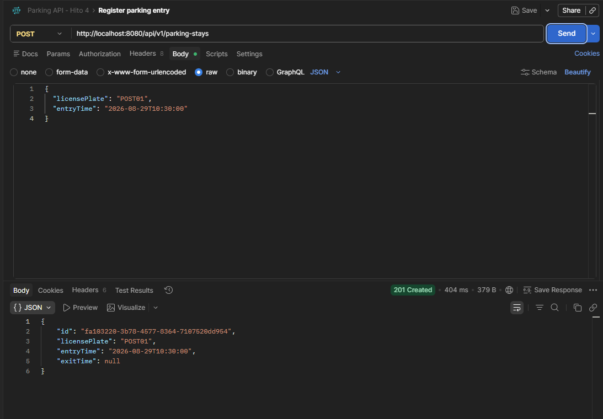

# Parking API

API REST para gestionar estadías de vehículos en estacionamientos. Permite registrar entradas, consultar estadías almacenadas y buscar una estadía activa mediante su patente.

El proyecto utiliza Spring Boot, PostgreSQL y Docker, manteniendo separadas las responsabilidades de dominio, aplicación e infraestructura.

## Funcionalidades actuales

- Registrar la entrada de un vehículo.
- Normalizar patentes a mayúsculas.
- Impedir más de una estadía activa para una misma patente.
- Consultar todas las estadías.
- Consultar una estadía por su identificador UUID.
- Buscar una estadía activa por patente.
- Persistir información en PostgreSQL.
- Entregar respuestas de error JSON estandarizadas.
- Documentar y probar la API mediante OpenAPI y Swagger UI.

## Stack tecnológico

- Java 25
- Spring Boot 3.5.16
- Spring Web MVC
- Spring Data JPA
- Hibernate
- Jakarta Validation
- PostgreSQL 16
- Docker Compose
- Springdoc OpenAPI 2.8.17
- Swagger UI
- Maven
- JUnit 5
- Mockito
- MockMvc
- AssertJ

## Arquitectura

El proyecto organiza sus responsabilidades en las siguientes áreas:

```text
src/main/java/cl/desafiolatam/parking
├── application
│   └── service
│       └── ParkingStayService
├── domain
│   ├── exception
│   ├── model
│   │   └── ParkingStay
│   └── port
│       └── ParkingStayRepository
└── infrastructure
    ├── persistence
    │   ├── adapter
    │   │   └── JpaParkingStayRepositoryAdapter
    │   ├── entity
    │   │   └── ParkingStayEntity
    │   └── repository
    │       └── ParkingStayJpaRepository
    └── web
        ├── controller
        │   └── ParkingStayController
        ├── dto
        └── exception
            └── GlobalExceptionHandler
```

El flujo principal de una petición es:

```text
Cliente HTTP
    → Controller
    → Servicio de aplicación
    → Contrato de repositorio
    → Adaptador JPA
    → Spring Data JPA
    → PostgreSQL
```

`ParkingStay` representa el modelo del negocio, mientras que `ParkingStayEntity` representa su almacenamiento mediante JPA. El adaptador realiza la conversión entre ambos modelos.

## Requisitos

Antes de ejecutar el proyecto se requiere:

- Java 25
- Maven 3.9 o compatible
- Docker Desktop
- Docker Compose

Para comprobar las instalaciones:

```powershell
java --version
mvn --version
docker --version
docker compose version
```

## Base de datos local

PostgreSQL se ejecuta dentro de un contenedor definido en `docker-compose.yml`.

La configuración local predeterminada es:

| Propiedad | Valor |
|---|---|
| Host | `localhost` |
| Puerto publicado | `55432` |
| Puerto del contenedor | `5432` |
| Base de datos | `parking_db` |
| Usuario | `parking_user` |
| Contraseña | `parking_password` |
| Contenedor | `parking-postgres` |

El puerto `55432` permite evitar conflictos con instalaciones locales o puertos reservados de Windows.

### Iniciar PostgreSQL

```powershell
docker compose up -d
```

Comprobar su estado:

```powershell
docker compose ps
```

El contenedor debe aparecer como `healthy`.

### Detener PostgreSQL

```powershell
docker compose down
```

Este comando detiene el servicio sin eliminar el volumen persistente.

## Instalación y ejecución

Después de clonar el repositorio, entra en su directorio e instala las dependencias ejecutando las pruebas:

```powershell
mvn clean test
```

Con PostgreSQL levantado, inicia la API utilizando Maven Wrapper.

En Windows:

```powershell
.\mvnw.cmd spring-boot:run
```

En Linux o macOS:

```bash
./mvnw spring-boot:run
```

Si Maven está instalado globalmente, también puede utilizarse:

```powershell
mvn spring-boot:run
```

La aplicación estará disponible en:

```text
http://localhost:8080
```

## Perfiles de configuración

### Desarrollo

El perfil predeterminado es `dev`.

Su configuración se encuentra en:

```text
src/main/resources/application-dev.yaml
```

Este perfil:

- utiliza PostgreSQL en `localhost:55432`;
- permite actualizar el esquema mediante Hibernate;
- muestra las consultas SQL;
- habilita OpenAPI;
- habilita Swagger UI.

### Producción

El perfil `prod` se encuentra en:

```text
src/main/resources/application-prod.yaml
```

Este perfil:

- exige credenciales mediante variables de entorno;
- valida el esquema sin modificarlo;
- no muestra las consultas SQL;
- mantiene OpenAPI y Swagger UI deshabilitados.

Variables requeridas:

| Variable | Descripción |
|---|---|
| `SPRING_PROFILES_ACTIVE` | Activa el perfil correspondiente, por ejemplo `prod` |
| `SERVER_PORT` | Puerto HTTP opcional; utiliza `8080` por defecto |
| `DB_URL` | URL JDBC requerida por el perfil `prod` |
| `DB_USER` | Usuario requerido por el perfil `prod` |
| `DB_PASSWORD` | Contraseña requerida por el perfil `prod` |

Ejemplo local en PowerShell:

```powershell
$env:SPRING_PROFILES_ACTIVE = "prod"
$env:SERVER_PORT = "8081"
$env:DB_URL = "jdbc:postgresql://localhost:55432/parking_db"
$env:DB_USER = "parking_user"
$env:DB_PASSWORD = "parking_password"

mvn spring-boot:run
```

Este ejemplo activa temporalmente el perfil `prod` utilizando la base de datos local únicamente para verificar su configuración. Permite comprobar que la API continúa funcionando, mientras Swagger UI y el contrato OpenAPI permanecen deshabilitados y la configuración de producción no contiene credenciales almacenadas directamente en los archivos del proyecto.

Los valores `parking_user` y `parking_password` corresponden exclusivamente al contenedor local. En un entorno productivo real, `DB_URL`, `DB_USER` y `DB_PASSWORD` deben ser proporcionados de forma segura por la plataforma de despliegue o mediante un gestor de secretos, sin incorporarlos al repositorio.


Después de realizar la comprobación local, se pueden eliminar las variables temporales:

```powershell
Remove-Item Env:SPRING_PROFILES_ACTIVE -ErrorAction SilentlyContinue
Remove-Item Env:SERVER_PORT -ErrorAction SilentlyContinue
Remove-Item Env:DB_URL -ErrorAction SilentlyContinue
Remove-Item Env:DB_USER -ErrorAction SilentlyContinue
Remove-Item Env:DB_PASSWORD -ErrorAction SilentlyContinue
```

## Documentación OpenAPI

Con el perfil `dev`, la documentación está disponible en:

- OpenAPI JSON: `http://localhost:8080/api-docs`
- Swagger UI: `http://localhost:8080/swagger-ui.html`

Los controladores y DTO se documentan mediante `@Tag`, `@Operation`, `@ApiResponses` y `@Schema`. Swagger UI permite ejecutar los endpoints mediante la opción **Try it out**.

Estas rutas permanecen deshabilitadas en el perfil `prod`.

## Endpoints

| Método | Ruta | Descripción | Respuesta exitosa |
|---|---|---|---|
| `GET` | `/api/v1/parking-stays` | Obtiene todas las estadías | `200 OK` |
| `GET` | `/api/v1/parking-stays/{id}` | Busca una estadía por UUID | `200 OK` |
| `GET` | `/api/v1/parking-stays/active/{licensePlate}` | Busca una estadía activa por patente | `200 OK` |
| `POST` | `/api/v1/parking-stays` | Registra la entrada de un vehículo | `201 Created` |

## Registrar una entrada

Solicitud:

```http
POST /api/v1/parking-stays
Content-Type: application/json
```

```json
{
  "licensePlate": "ABCD12",
  "entryTime": "2026-08-26T22:50:00"
}
```

Respuesta:

```json
{
  "id": "03227f66-76dc-4e71-be12-78ca6e869afd",
  "licensePlate": "ABCD12",
  "entryTime": "2026-08-26T22:50:00",
  "exitTime": null
}
```

La respuesta utiliza `201 Created` e incluye una cabecera `Location` con la URL del recurso creado.

Una estadía con `exitTime` igual a `null` se considera activa. Si la patente ya tiene una estadía activa, la API rechaza la nueva entrada con `409 Conflict`.


### Evidencia de prueba con Postman

La siguiente prueba registra una estadía mediante el endpoint `POST /api/v1/parking-stays` y confirma la respuesta `201 Created`:




## Respuestas de error

Los errores se entregan mediante una estructura JSON común:

```json
{
  "code": 409,
  "message": "An active parking stay already exists for license plate: ABCD12",
  "timestamp": "2026-08-26T23:11:13.3743011"
}
```

Estados utilizados:

| Estado | Situación |
|---|---|
| `400 Bad Request` | Datos inválidos o JSON mal formado |
| `404 Not Found` | Estadía oe stadía activa inexistente |
| `409 Conflict` | La patente ya tiene una estadía activa |

## Pruebas

La suite incluye:

- pruebas unitarias del servicio;
- pruebas web del controlador y contratos HTTP;
- pruebas del manejador global de errores;
- pruebas de integración con JPA y PostgreSQL;
- prueba de arranque del contexto de Spring.

Ejecutar:

```powershell
mvn clean test
```

Actualmente el proyecto cuenta con 13 pruebas automatizadas.

PostgreSQL debe estar levantado porque las pruebas de persistencia utilizan la base de datos real configurada en el perfil `dev`.

## Empaquetado

El proyecto está configurado para generar un archivo WAR:

```powershell
mvn clean package
```

El artefacto se genera dentro de:

```text
target/parking-api-0.0.1-SNAPSHOT.war
```
